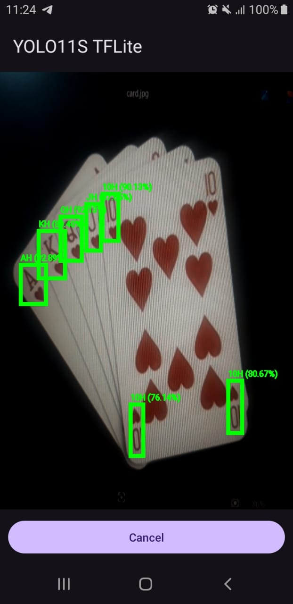
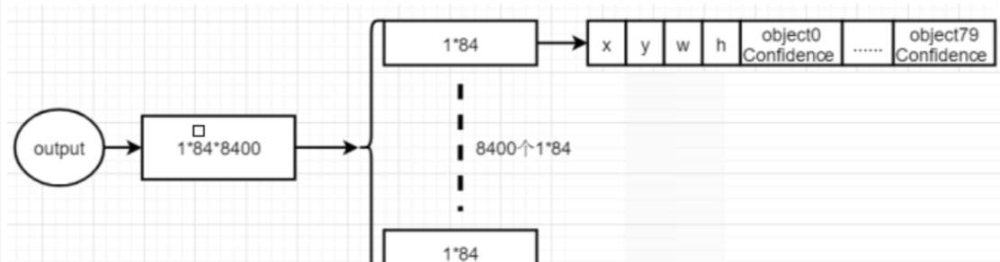

# YOLO11s Android App

This is an Android application (Java) that runs the **YOLO11s** object detection model on mobile devices using **TensorFlow Lite (TFLite)**. The app allows object detection on captured frames using the YOLO11s model optimized for edge devices.

## Features
- Runs **YOLO11s** model on Android devices using **TFLite**.
- Live camera feed with manual detection.
- Captures the current frame when the **Detect** button is clicked.
- Displays detected objects with bounding boxes, class names, and confidence scores.

## Model Conversion
To convert a YOLO model into the **TFLite** format, refer to the **YOLO11S_Convert_to_TFLite.ipynb** notebook included in this repository.

## Pretrained Model
This repository includes a YOLO11s model pretrained for playing card symbol detection. However, you can use your own trained model by converting it to TFLite format and replacing the provided model.

## Screenshots
### Detection Output


### Tensor Shape Output
The output tensor shape and its details (for COCO dataset, 80 classes) can be found in the following GitHub discussion:
[Ultralytics Discussion #17254](https://github.com/orgs/ultralytics/discussions/17254)



## Requirements
- Android 7.0 (API level 24) or higher
- TensorFlow Lite dependencies added to `build.gradle`
- A device with a camera for capturing frames

## Setup & Installation
1. Clone this repository:
   ```sh
   git clone https://github.com/tharushaudana/YOLO11S-TFLite-Android-Java.git
   ```
2. Open the project in **Android Studio**.
3. Ensure that `TensorFlow Lite` dependencies are added in `build.gradle`:
   ```gradle
   implementation("org.tensorflow:tensorflow-lite:2.9.0")
   implementation("org.tensorflow:tensorflow-lite-task-vision:0.3.1")
   implementation("org.tensorflow:tensorflow-lite-gpu:2.9.0")
   ```
4. Place the **TFLite** model and `classes.txt` inside the `assets` folder.
5. Run the app on an Android device/emulator.

## Usage
1. Launch the app.
2. Grant camera permissions.
3. View the live camera feed.
4. Click the **Detect** button to capture the current frame.
5. The detected objects will be displayed with bounding boxes, class names, and confidence scores.

## Acknowledgments
- [TensorFlow Lite](https://www.tensorflow.org/lite)
- [Ultralytics](https://github.com/ultralytics)